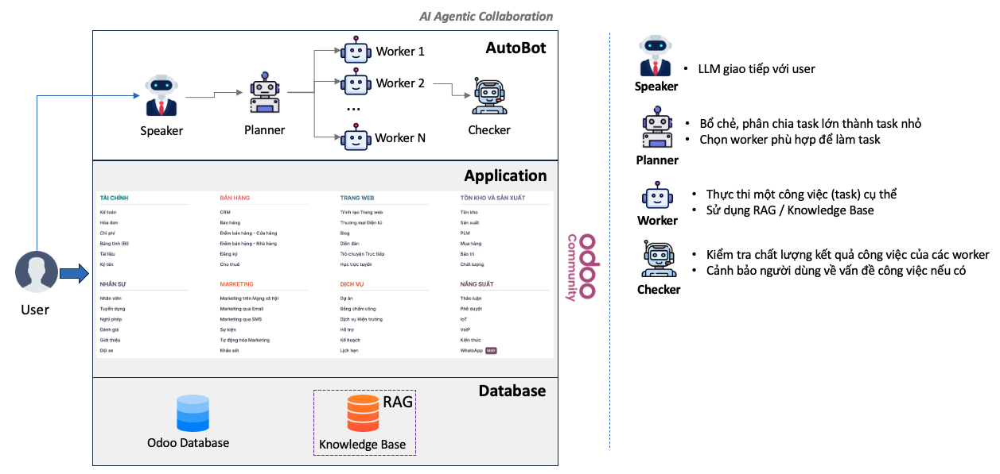

# RUN CODE
## 1. Clone this repository
```
git clone https://github.com/binhle2001/multi-agent.git
cd multi-agent
```

## 2. Build virtual environment
```
git clone 
python3 -m venv .venv
source .venv/bin/activate
pip install -r requirements.txt
```
## 3. Setup database
```
docker compose up -d #create DB
python seed/chatbot_work_scheduler.py
python seed/chatbot_machine.py
python seed/chatbot_material.py
```
## 4. Run HRM Agent
```
python agent_hrm.py
```
## 5. Run Inventory Agent
```
python agent_inventory.py
```
## 6. Run Global Agent
```
python agent_global.py
```
## 7. Run Health Check Agent
```
python agent_health_check.py
```
## 8. Test API using Postman and follow community logs
### API POST GLOBAL AGENT
```
URL: http://localhost:8883/agent_global/api/v1/chat
Method: POST
Body (raw JSON):
{
  "content": ""
}
```
### API GET COMMUNITY LOGS
```
URL: http://localhost:8884/agent_health_check/api/v1/communication
Method: GET
Body: None (Empty JSON)
{}
```
# Workflow

## 1. Giải thích về luồng hoạt động
Agent Global đóng vai trò là một planer và một speaker, có nhiệm vụ nhận yêu cầu từ người dùng thông qua API chat. Sau khi nhận yêu cầu, Agent Global sẽ extract intent mà người dùng muốn hỏi và chia việc cho các worker, cụ thể ở đây sẽ có 3 worker là:
1. Agent HRM: Nhận nhiệm vụ lấy thông tin, cập nhật thông tin về nhân sự.  
2. Agent Machine: Nhận nhiệm vụ lấy thông tin, cập nhật thông tin về máy móc.  
3. Agent Material: Nhận nhiệm vụ lấy thông tin, cập nhật thông tin về nguyên vật liệu.  
Ví dụ như khi người dùng thông báo "Hôm nay Lê Trần Lâm Bình xin đăng ký làm ca 3 với sản lượng là 200" thì Planer sẽ extract intent của HRM là [UPDATE] sau đó Agent HRM sẽ cập nhật bản ghi dựa theo yêu cầu của người dùng, sau đó phản hồi lại thông tin về db sau khi cập nhật cho Planer, Planer sẽ gửi thông tin cho Speaker để summarize rồi trả lời người dùng.
## 2. Giải thích về luồng lên kế hoạch sản xuất
Hàng ngày, theo thời gian chạy cronjob, hệ thống sẽ tự động gọi đến các module HRM, Machine, Material để lấy thông tin về 3 module đó để lên kế hoạch sản xuất. Nếu thông tin trên các module bị thay đổi, ví dụ thay đổi về nhân sự, máy móc thì hệ thống sẽ phải cập nhật lại luôn kế hoạch sản xuất của ngày hôm đó rồi lưu ra file logs.  
Khi người dùng có nhu cầu xem kế hoạch sản xuất thì gọi đến API "/planing" để xem kế hoạch sản xuất của ngày hôm đó.

